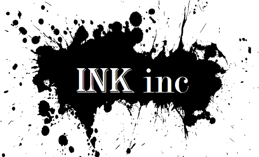
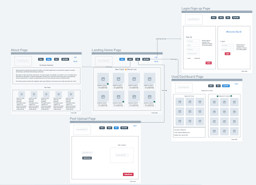
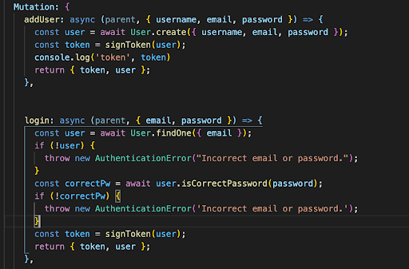
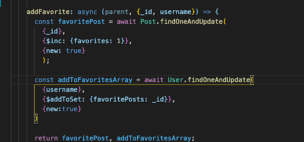

# Ink Inc. 

  A media app focused on the art of tattoos. Upload your art and save your favorites from other users. This web app was made as a final project by students for the full stack web development bootcamp.
  # Table of Contents:
  * [Installation](#installation)
  * [Usage](#usage)
  * [Development](#development)
  * [Visuals](#visuals)
  * [Resources](#resources)
  * [Contributing](#contributing)
  * [Tests](#tests)
  * [Questions](#questions)
  * [License](#license)
---
  ## Installation:
  There is no installation needed! All you need to do is click the Heroku link! If you want to have it for yourself, either fork it, or clone it down to your machine!

  link to website: https://inkinc-frontend.herokuapp.com/ ... https://ink-inc-backend.herokuapp.com/

  Github links: https://github.com/EMJBB-Project-3 ... https://github.com/EMJBB-Project-3/ink-inc-frontend ... https://github.com/EMJBB-Project-3/ink-inc-backend

  ## Usage:
  This project is used for people to explore the wonderful world of Tattoo art! You can share, post, and save your favorite tattoo art! This app is designed for people who like to enjoy their "artsy" side!
  ## Development
  React
  Firebase Storage
  ## Visuals
  
  
  
  
  
  ## Resources
  * Bootcampspot https://bootcampspot.com/
  * Stackoverflow https://stackoverflow.com/
  * AntDesign https://ant.design/

  We utilized our instructor, TA's, classmates, and our groupmates!
  We utilized a lot of prior assignments and lessons from our classtime.
  Without the assignments and help from others, this would not be possible!
  MAJOR SHOUT OUT to Miles from the Inkinc group! He shouldered A LOT of this. He is truly amazing and one of a kind! He was very, very helpful!
  ## Contributing:
  N/A
  ## Tests:
  N/A
  ## Questions:
  For any further assistance, you may contact me at:
  * Evan's Github: [ebulliner](<https://github.com/ebulliner>)
  * Baagii's Github: [baagii-bit](<https://github.com/baagii-bit>)
  * Miles' Github: [monstermiles](<https://github.com/monstermiles>)
  * Jackie's Github: [jack-ie](<https://github.com/jack-ie>)
  * Brandon's Github: [brandonawilliams1](<https://github.com/brandonawilliams1>)
  
  ---
  ___
# License
  ## MIT
  This project is licensed under the [MIT License](https://opensource.org/licenses/MIT).